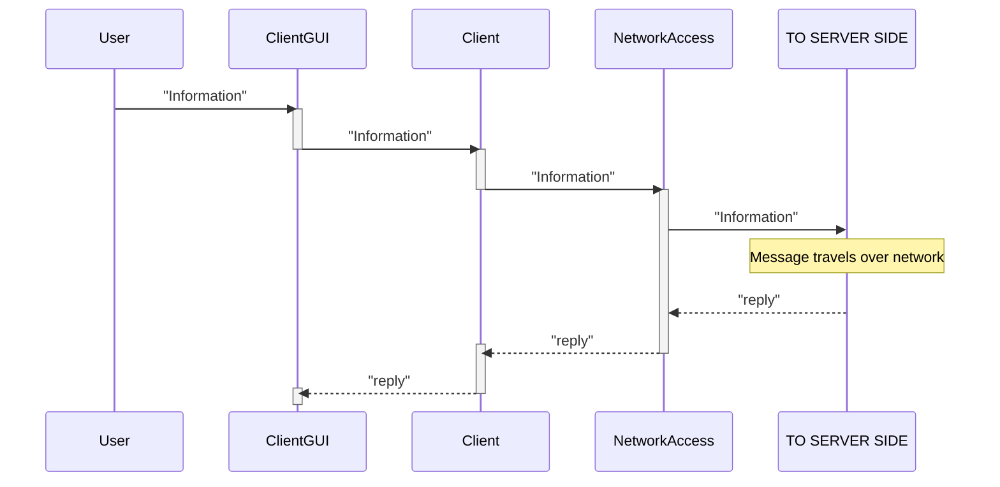
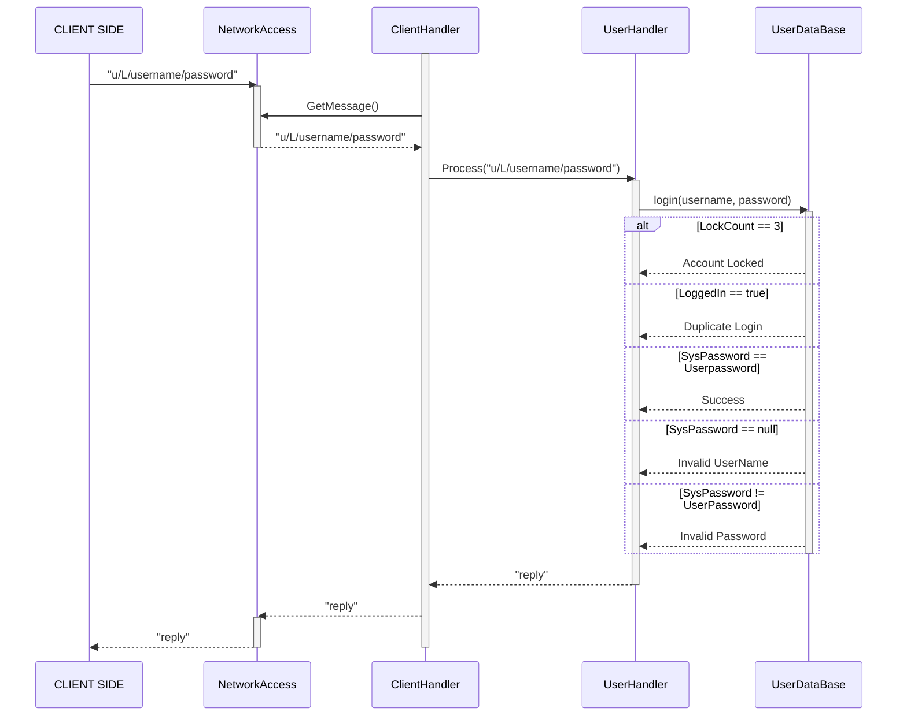
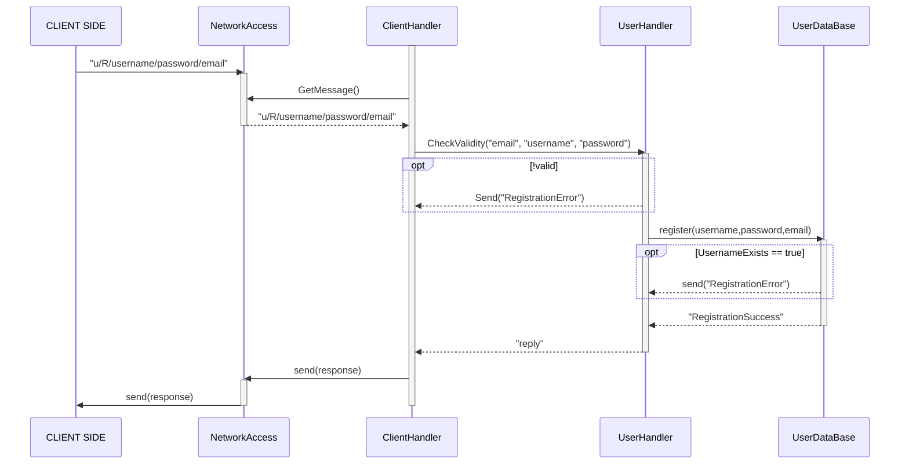
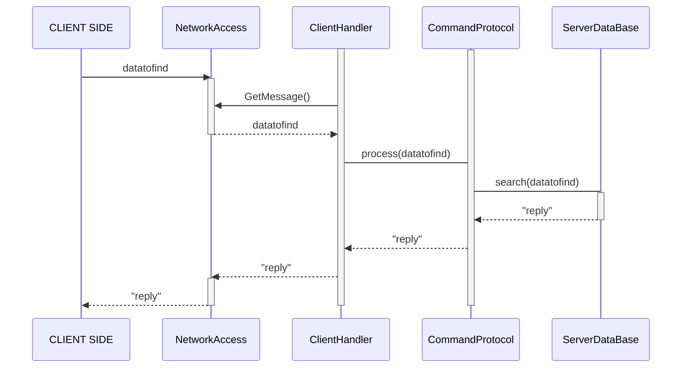
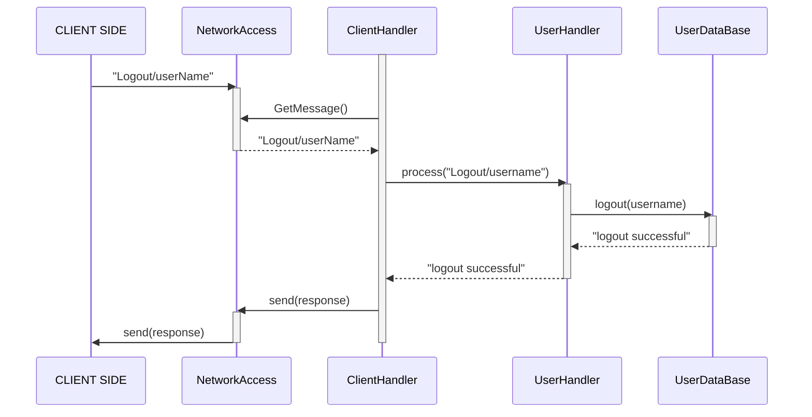
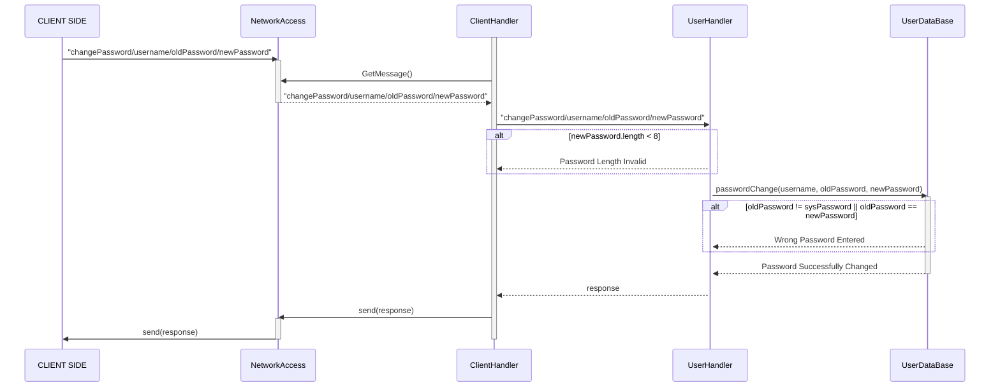
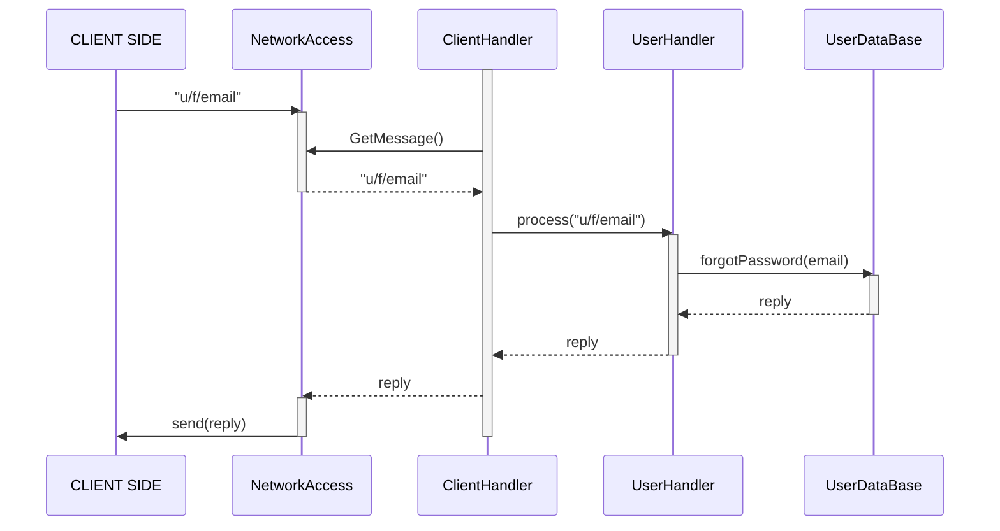
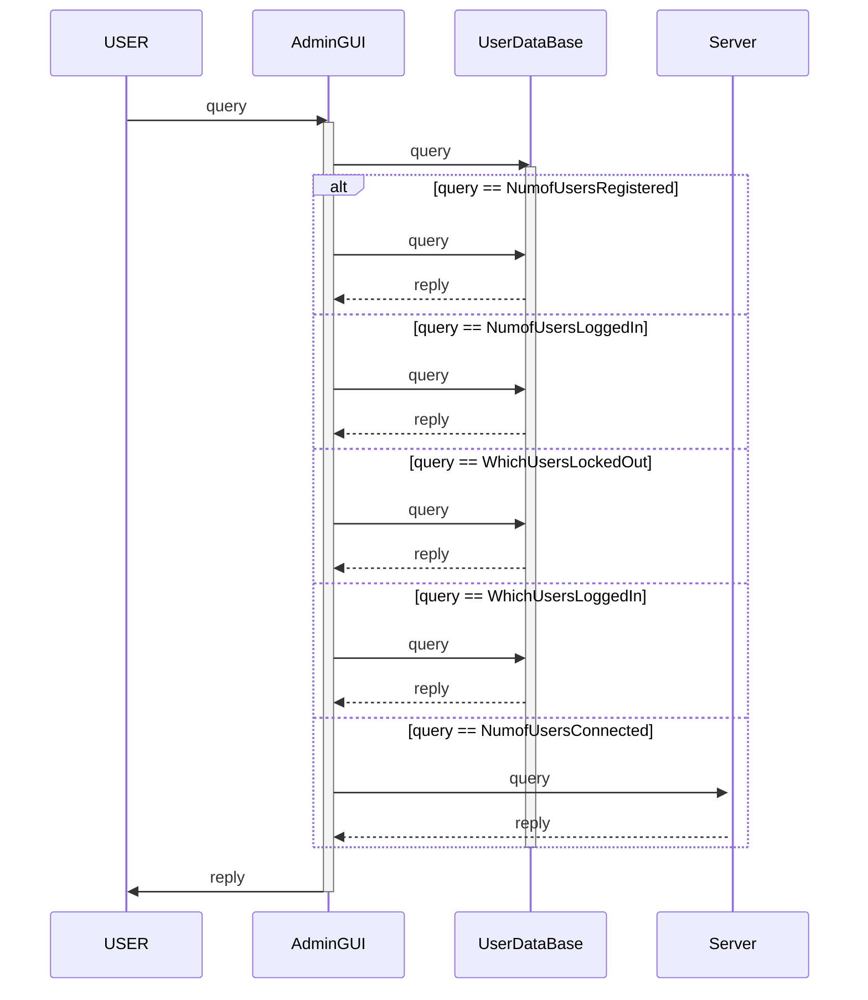
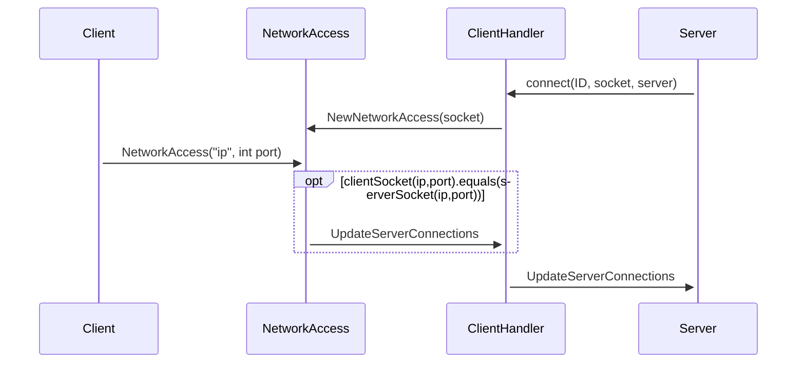
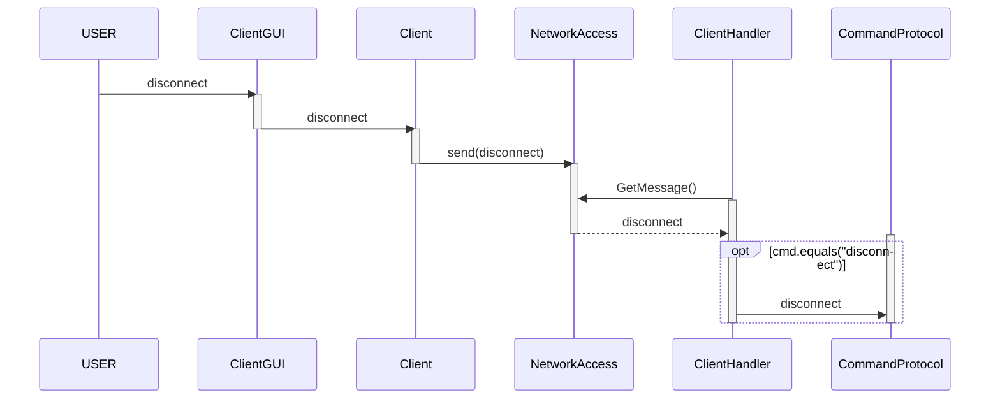

Generic Client-Side Sequence Diagram

Login Diagram - Server Side

User Registration - Server Side

Query Server - Server Side

Logout - Server Side

Password Change - Server Side

Forgotten Password - Server Side

Query System Admin Data

Create connection

Disconnect Client

