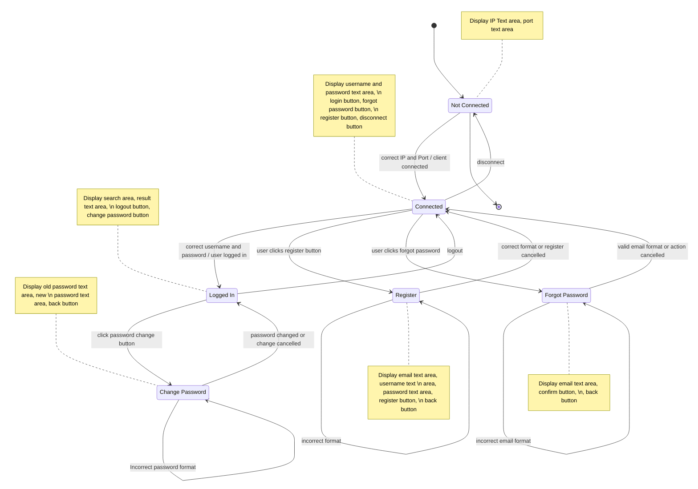

Client side state diagram

```mermaid
stateDiagram-v2
    state "Not Connected" as s1
    state "Connected" as s2
    state "Logged In" as s3
    state "Change Password" as s4
    state "Register" as s5
    state "Forgot Password" as s6
    [*] --> s1
    s1 --> s2: correct IP and Port / client connected
    s2 --> s3: correct username and password / user logged in
    s3 --> s4: click password change button
    s4 --> s4: Incorrect password format
    s4 --> s3: password changed or change cancelled
    s3 --> s2: logout
    s2 --> s5: user clicks register button
    s5 --> s5: incorrect format
    s5 --> s2: correct format or register cancelled
    s2 --> s6: user clicks forgot password
    s6 --> s6: incorrect email format
    s6 --> s2: valid email format or action cancelled
    s2 --> s1: disconnect
    s1 --> [*]
    note left of s1: Display IP Text area, port text area
    note left of s2: Display username and password text area, \n login button, forgot password button, \n register button, disconnect button
    note left of s3: Display search area, result text area, \n logout button, change password button
    note left of s4: Display old password text area, new \n password text area, back button
    note right of s5: Display email text area, username text \n area, password text area, register button, \n back button
    note right of s6: Display email text area, confirm button, \n, back button
```