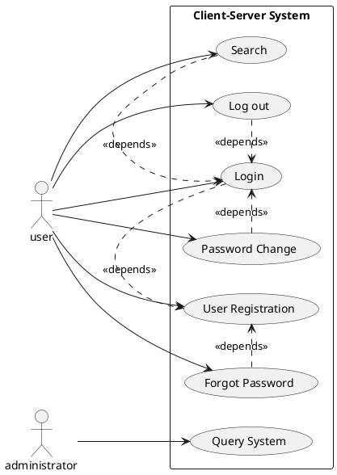

```puml
@startuml
left to right direction
actor user
actor administrator
rectangle "Client-Server System"{
usecase Login as uc1
usecase "Log out" as uc2
usecase "User Registration" as uc3
usecase "Password Change" as uc4
usecase "Forgot Password" as uc5
usecase "Search" as uc6
usecase "Query System" as uc7
}
user --> uc1
user --> uc2
user --> uc3
user --> uc4
user --> uc5
user --> uc6
administrator --> uc7
uc2 .> uc1: <<depends>>
uc4 .> uc1: <<depends>>
uc1 .> uc3: <<depends>>
uc5 .> uc3: <<depends>>
uc6 .> uc1: <<depends>>
@enduml
```