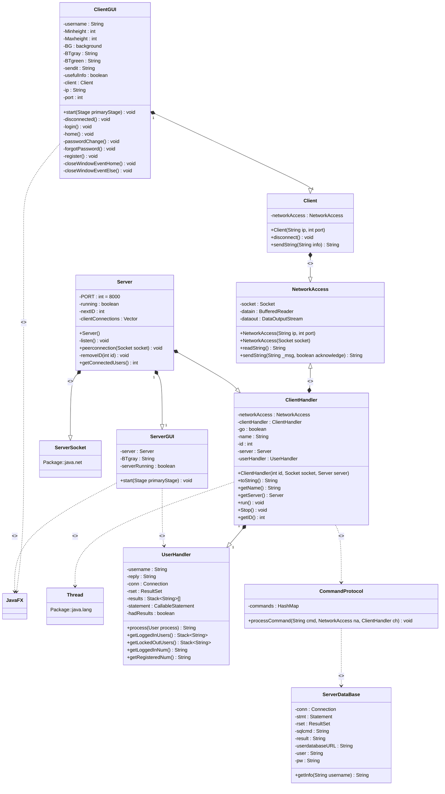

```mermaid
classDiagram
ClientGUI ..> JavaFX : <<extends>>
ClientGUI "1"*--|> "1" Client
Client *--|> NetworkAccess : <<private>>
NetworkAccess <|--* ClientHandler : <<private>>
ClientHandler ..> Thread : <<extends>>
ClientHandler "1" *--|> "1" UserHandler
ClientHandler ..> CommandProtocol : <<uses statically>>
CommandProtocol ..> ServerDataBase : <<uses>>
Server *--|> ClientHandler
Server *--|> ServerSocket : <<private>>
Server "1"*--|>"1" ServerGUI
ServerGUI ..> UserHandler : <<uses>>
ServerGUI ..> JavaFX : <<extends>>

class ClientGUI{
    -username : String
    -Minheight : int
    -Maxheight : int
    -BG : background
    -BTgray : String
    -BTgreen : String
    -sendit : String
    -usefulInfo : boolean
    -client : Client
    -ip : String
    -port : int
    +start(Stage primaryStage) void
    -disconnected() void
    -login() void
    -home() void
    -passwordChange() void
    -forgotPassword() void
    -register() void
    -closeWindowEventHome() void
    -closeWindowEventElse() void
}

class Client{
    -networkAccess : NetworkAccess
    +Client(String ip, int port)
    +disconnect() void
    +sendString(String info) String
}

class NetworkAccess{
    -socket : Socket
    -datain : BufferedReader
    -dataout : DataOutputStream
    +NetworkAccess(String ip, int port)
    +NetworkAccess(Socket socket)
    +readString() String
    +sendString(String _msg, boolean acknowledge) String
}

class ClientHandler{
    -networkAccess : NetworkAccess
    -clientHandler : ClientHandler
    -go : boolean
    -name : String
    -id : int
    -server : Server
    -userHandler : UserHandler
    +ClientHandler(int id, Socket socket, Server server)
    +toString() String
    +getName() String
    +getServer() Server
    +run() void
    +Stop() void
    +getID() int
}

class UserHandler{
    -username : String
    -reply : String
    -conn : Connection
    -rset : ResultSet
    -results : Stack~String~[]
    -statement : CallableStatement
    -hadResults : boolean
    +process(User process) String
    +getLoggedInUsers() Stack~String~
    +getLockedOutUsers() Stack~String~
    +getLoggedInNum() String
    +getRegisteredNum() String
}

class CommandProtocol{
    -commands : HashMap
    +processCommand(String cmd, NetworkAccess na, ClientHandler ch) void
}

class ServerDataBase{
    -conn : Connection
    -stmt : Statement
    -rset : ResultSet
    -sqlcmd : String
    -result : String
    -userdatabaseURL : String
    -user : String
    -pw : String
    +getInfo(String username) String
}

class Server{
    -PORT : int = 8000
    -running : boolean
    -nextID : int
    -clientConnections : Vector<ClientHandler>
    +Server()
    -listen() void
    +peerconnection(Socket socket) void
    -removeID(int id) void
    +getConnectedUsers() int
}

class ServerGUI{
    -server : Server
    -BTgray : String
    -serverRunning : boolean
    +start(Stage primaryStage) void
}

class ServerSocket{
    Package::java.net
}

class Thread{
    Package::java.lang
}
```